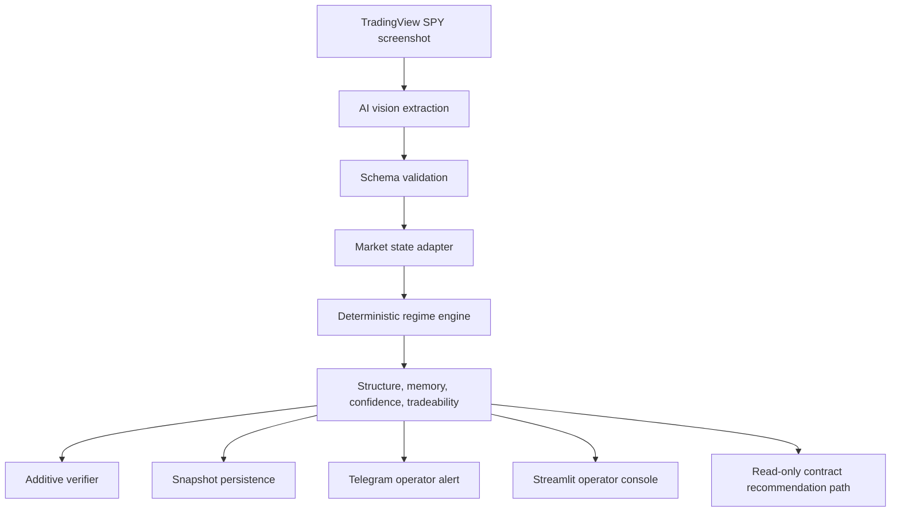
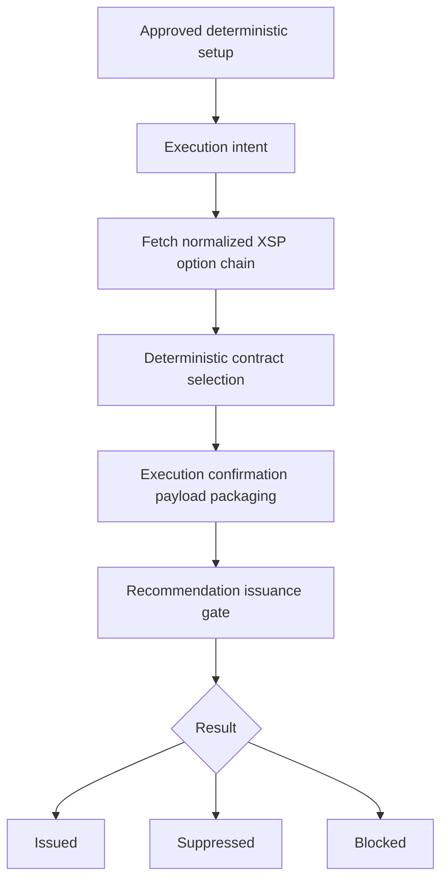

# XSP Trading Copilot

Governance first decision support architecture for intraday XSP options analysis.

XSP Trading Copilot is an AI assisted trading support system built around a strict separation of perception and authority. SPY chart screenshots feed an AI vision layer that extracts structured market state; every downstream decision runs through deterministic Python services.

Signature doctrine: **LLMs propose. Code enforces.**

## What This Is

This repository documents the architecture and operating doctrine of a deterministic intraday options analysis system. The full local implementation includes services for screenshot ingestion, schema validation, regime classification, confidence scoring, tradeability scoring, snapshot persistence, Telegram alerts, Streamlit operator pages, and read-only XSP contract recommendation packaging.

The system is designed for operator clarity: it summarizes apparent market structure, identifies invalidation context, suppresses weak or contradictory states, and surfaces recommendation artifacts for human review.

It does **not** execute trades. All trading decisions remain with the operator.

## Why It Exists

Intraday options workflows degrade quickly when visual interpretation, execution pressure, and noisy signals compete for attention. XSP Trading Copilot was built to separate perception from authority:

* AI vision extracts chart observations.
* Deterministic services classify regimes and score readiness.
* Operator surfaces present concise, auditable context.
* Safety gates fail closed when inputs are missing, malformed, ambiguous, or low quality.

The goal is disciplined decision support, not machine-directed execution.

## Core Architecture

The architecture keeps probabilistic model output upstream of deterministic enforcement. AI handles perception and optional verification; it is never the decision authority.

## AI vs Deterministic Responsibility Split

| Layer | Responsibility | Authority |
| --- | --- | --- |
| AI vision | Extract structured observations from SPY screenshots | Non-authoritative perception |
| JSON/schema validation | Require expected fields and categorical values | Deterministic gate |
| Regime engine | Classify market regime and bias from normalized state | Authoritative |
| Structure and memory | Track OH/OL interaction, range state, and same-day failures | Authoritative |
| Confidence and tradeability | Score conviction, setup clarity, hold validity, and environment quality | Authoritative |
| Verifier | Provide optional second-pass context | Additive only |
| Operator agent | Call bounded read only market data tools | Non-authoritative |
| Contract recommendation | Package deterministic, read only recommendation artifacts | Recommendation only |

## Main Pipeline Overview

1. A SPY chart screenshot is selected from a watched folder.
2. AI vision extracts a structured market state payload.
3. Schema validation rejects incomplete or malformed payloads.
4. A deterministic runner normalizes the payload and calls the regime engine.
5. Market structure enrichment computes OH/OL distance and price zone.
6. Session memory updates same day OH/OL break, failure, and range return state.
7. Setup clarity, confidence, and tradeability services score the state.
8. An optional verifier reviews the screenshot and deterministic output without override authority.
9. A snapshot is persisted for later review.
10. Telegram and Streamlit surfaces present the result to the operator.

## Operator Surfaces

* **Streamlit Live Session**: primary operator console with decision-first layout, invalidation context, quality metrics, diagnostics, and read-only recommendation display.
* **Latest Screenshot Run**: fast one shot ingestion surface for the newest screenshot.
* **Regime Evolution Review**: post session sequence analysis from screenshots or persisted snapshots.
* **Telegram**: compact mobile alerts with duplicate/cooldown suppression and weak state gating.
* **Operator agent harness**: bounded read-only market-data assistant for option chain, expiration, and quote queries.

## Key Capabilities

* AI-assisted SPY chart perception with strict JSON expectations.
* Deterministic market regime classification.
* OH/OL structure tracking and same day session memory.
* First-break, reclaim, continuation, and fake-breakout handling.
* Confidence, setup clarity, and tradeability scoring.
* Fail-closed handling for malformed input, missing state, provider failures, or unsupported tool requests.
* Snapshot persistence for post-session review.
* Telegram and Streamlit operator surfaces.
* Compact audit logging for operator-agent invocations.
* Deterministic recommendation issuance logging and duplicate suppression.

## Automatic Contract Recommendation

The full local system includes a read-only automatic contract recommendation path for already authoritative approved setups.

This path does not create eligibility, does not place orders, and does not call a broker execution path. It packages a recommendation artifact for operator review after deterministic services have already established readiness.

## Observability and Audit Logging

The system emphasizes observable state transitions:

* Stage level success and failure tracking in the screenshot pipeline.
* Persisted snapshots with enrichment payloads for structure, confidence, setup clarity, and tradeability.
* Telegram send boundary metadata for alert suppression and delivery behavior.
* Operator-agent audit rows with compact request classification and tool-call metadata.
* Recommendation issuance events for issued, suppressed, and blocked outcomes.

Outcome tracking is intentionally scoped. Engine-level signal review exists in the private system. Contract level outcome tracking for agent called recommendations is still in progress and should not be interpreted as complete performance attribution.

## Safety Boundaries

* The system is not an auto-trader.
* The system does not place broker orders.
* The operator executes manually.
* LLM outputs never override deterministic services.
* Verifier output is additive only.
* Operator-agent tools are read-only and bounded by an allowlist.
* Contract recommendation is recommendation-only.
* Missing or ambiguous inputs fail closed.
* No financial performance guarantees are made.

## Validation and Testing Scope

Private validation covers the major deterministic boundaries described in this showcase, including:

* operator tool harness validation
* operator-agent output contract validation
* recommendation issuance gate validation
* automatic contract recommendation orchestrator validation
* schema and fail-closed behavior around market-data tool usage

This public repository is documentation first and intentionally excludes production credentials, local data, raw screenshots, database files, broker/account artifacts, and proprietary live configuration.

## Repo Contents

| Path | Purpose |
| --- | --- |
| `README.md` | Public overview and portfolio narrative |
| `DISCLAIMER.md` | Safety and legal disclaimer |
| `docs/ARCHITECTURE.md` | Technical architecture and dataflow |
| `docs/SYSTEM_DOCTRINE.md` | Trading-system doctrine and deterministic authority rules |
| `docs/SAFETY_AND_LIMITATIONS.md` | Boundaries, limitations, and known risks |
| `docs/OBSERVABILITY.md` | Auditability, persistence, and failure tracking |
| `examples/` | Synthetic public-safe JSON examples |

## Roadmap

* Expand public safe diagrams and example payloads as the private architecture evolves.
* Add sanitized screenshots or mocked UI images when safe to publish.
* Continue improving recommendation observability without adding execution authority.
* Complete contract-level outcome tracking for recommendation artifacts.
* Document additional operator review workflows in public safe form.

## Disclaimer

This repository is an educational, research, and portfolio project. It is not financial advice, investment advice, or a trading recommendation service. Options trading involves substantial risk and may not be suitable for all investors. No results are guaranteed.