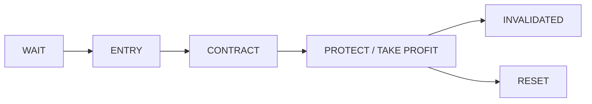
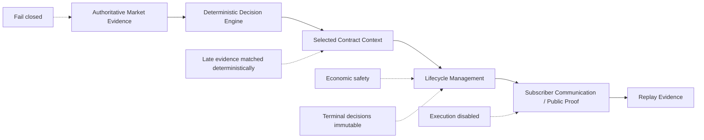

# ASUMASNAM XSP

ASUMASNAM XSP is data-driven XSP 0DTE decision support from qualified setup to completion.

**Clarity at every decision point. Transparency without the noise.**

The operator makes the trade. The system makes the decision path visible.

It is not an autonomous trading bot. Broker execution and options execution are disabled.

Core principle: **AI can observe. Code must enforce. The operator decides.**

## Clarity at Every Decision Point

ASUMASNAM turns validated market evidence into a deterministic lifecycle that a subscriber can follow without receiving a firehose of internal states. It identifies when evidence is insufficient, when a setup qualifies, which XSP contract was selected, when risk guidance changes, and when the thesis is complete or invalid.

## The Decision Path

- **WAIT** — evidence is not yet sufficient for a qualified setup.
- **ENTRY** — a setup has met the public decision boundary.
- **CONTRACT** — the exact selected XSP contract and alert basis are attached.
- **PROTECT** — risk guidance has tightened; this is not an execution command.
- **TAKE PROFIT** — the system is signaling risk-management guidance, not claiming a subscriber sale or realized profit.
- **INVALIDATED** — the thesis no longer qualifies under the evidence contract.
- **RESET** — the lifecycle is closed for the session.

## Authoritative Market Evidence

Production market authority is **AMEX:SPY** using confirmed five-minute bars. BATS is not the current production authority.

Source and timeframe validation fail closed. Non-authoritative evidence cannot silently substitute for the approved source or drive a production decision.

## Evidence-First Architecture

AI-assisted engineering and perception can support the system, but production decisions are governed by validated evidence and deterministic code. See [Architecture](docs/ARCHITECTURE.md) and [System Doctrine](docs/SYSTEM_DOCTRINE.md).

## Selected Contract Context

ASUMASNAM persists the exact selected XSP contract and its authoritative alert basis. Public proof follows that contract from the contract price recorded at the alert—not a hypothetical or reconstructed entry.

Private contract-selection logic, thresholds, and provider-specific matching remain outside this repository.

## Capital Safety

Selected-contract economics act as an independent safety check on the lifecycle. Optimistic market-state language cannot override clearly contradictory selected-contract economics.

Missing, stale, mismatched, or contradictory evidence fails closed. Delayed evidence cannot resurrect a completed or invalidated decision.

Market evidence and contract economics may arrive at different times. Late-arriving evidence is deterministically matched to the decision it belongs to rather than being forgotten or combined with an unrelated state.

## Subscriber Lifecycle

Subscriber communication follows the decision path: WAIT, ENTRY, CONTRACT, PROTECT, TAKE PROFIT, INVALIDATED, and RESET. Subscribers see the meaningful lifecycle—not every internal evaluation or implementation state.

Telegram is a communication surface for this bounded lifecycle. It does not grant trading or broker authority.

## Public Proof

Automatic opening public proof is production-proven for qualified selected contracts. It reports the CALL or PUT side, selected contract, expiration, and contract price at alert.

The repaired terminal setup-complete route is deployed and awaiting natural production acceptance. It is not yet described as naturally production-proven.

Public terminal semantics describe the selected contract, alert basis, post-alert contract high, and maximum post-alert move. Public proof reports selected-contract behavior from its authoritative alert basis. It does not represent subscriber execution or realized P/L.

See [Public Proof and Production Lessons](docs/PUBLIC_PROOF_RELEASE.md).

## Replay-Capable Evidence

Backend v1.4 support is deployed and preserves replay-capable open, high, low, close, and volume bar evidence with source and timestamp identity. Live validity and replay capability are evaluated separately.

A session becomes replay-ready only after it passes completeness and readiness checks. Partial, mixed, duplicate, or otherwise insufficient evidence is not promoted merely because some replay fields exist.

The next complete natural production session is intended to provide the first full natural replay-readiness acceptance opportunity. A production replay-video renderer is not currently shipped.

## What the System Does Not Do

- It does not execute broker or options orders.
- It does not make the operator's trading decision.
- It does not allow AI output to override deterministic gates.
- It does not turn missing or ambiguous evidence into confidence.
- It does not report subscriber returns or realized P/L.
- It does not guarantee outcomes.

## Production Lessons

Production evidence is used to turn observed weaknesses into durable invariants:

- Contract behavior is measured from the actual selected-contract alert basis.
- Selected-contract economics independently constrain optimistic lifecycle states.
- Late evidence must match the decision it belongs to.
- Migration and replay enrichment cannot bypass evidence authority.

These are engineering lessons, not a winner gallery.

## Current Status

**Production-proven**

- deterministic XSP decision lifecycle
- AMEX:SPY authority and fail-closed evidence handling
- selected-contract context
- Telegram lifecycle communication
- automatic X opening proof

**Deployed / awaiting natural acceptance**

- repaired automatic X terminal posting
- first full natural-session replay-readiness acceptance for v1.4

**Roadmap**

- deterministic session replay renderer
- prior-day public replay/video artifacts

Replay rendering is a planned consumer of the evidence archive; it is not shipped functionality or a promise of daily videos.

## Roadmap

The bounded public roadmap is to validate complete natural-session replay readiness, accept the repaired terminal public-proof path in production, and later build deterministic replay rendering from preserved evidence.

## Disclaimer

This repository is an educational, research, and public-proof artifact. It is not financial or investment advice and is not a trading recommendation service. Options trading involves substantial risk and may not be suitable for all investors. No result is guaranteed.

See [Safety and Limitations](docs/SAFETY_AND_LIMITATIONS.md) and the [Broker Safety Boundary](docs/BROKER_SAFETY_BOUNDARY.md).
