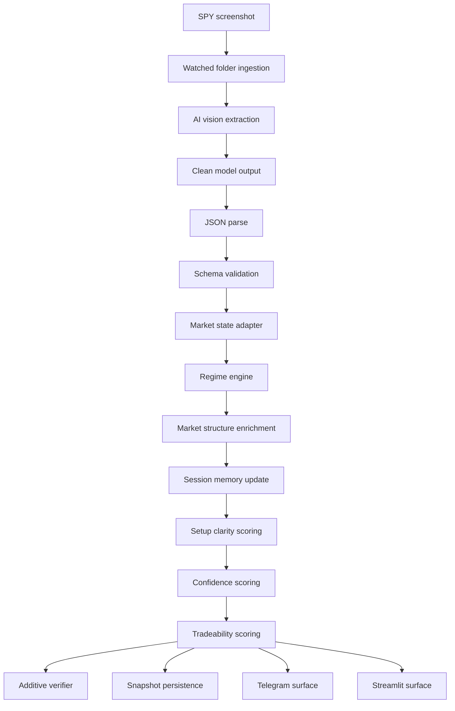
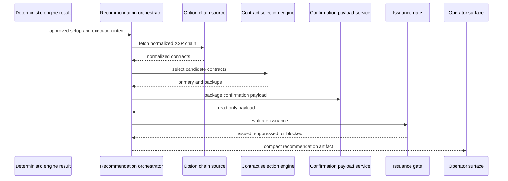

# Architecture

The system is organized around a strict authority boundary: AI observes and verifies; deterministic services decide what is valid to surface. The full local system uses SPY screenshots as the reference input and XSP 0DTE contracts as the recommendation context.

## System Flow

## Screenshot Ingestion

The production workflow begins with screenshots saved to a watched folder. Filenames are normalized into metadata: symbol, trade date, and capture time. SPY screenshots are the primary reference input because SPY is the observed instrument for market structure interpretation.

Invalid filenames, non image files, or unsupported symbols are rejected before the decision pipeline.

## AI Vision Extraction

The vision layer calls an OpenAI vision capable model to extract structured market state from a chart image. This layer is perception only. It may identify fields such as current price, opening high, opening low, first break direction, visual bias, and uncertainty flags.

Model output is treated as untrusted until it passes deterministic cleaning, parsing, and validation.

## Schema Validation

The extracted payload must satisfy a schema before it reaches the regime engine. Required fields include core market-state values: trade date, current time, opening high, opening low, and current price. Optional categorical fields are constrained to known values.

Schema validation is a fail-closed gate. Malformed JSON, missing required fields, or unexpected categorical values stop the pipeline rather than produce a speculative output.

## Deterministic Regime Engine

The regime engine is the authoritative classifier. It applies ordered rule logic to normalized market state and returns a regime, directional bias, and invalidation context.

Representative regime states include:

- `trend_up`
- `trend_down`
- `opening_reversal`
- `fake_breakout_chop`
- `late_reclaim`
- `failed_breakdown_trend_day`
- `gamma_expansion`
- `neutral` / `undecided`

## Market Structure Enrichment

Market structure enrichment computes the relationship between current price and the opening range: distance to OH, distance to OL, and price zone classification (above OH, below OL, near OH, near OL, or inside range).

This helps downstream services distinguish clean continuation from range rotation or failed breakout behavior.

## Session Memory

Session memory tracks same-day OH/OL interactions: whether OH or OL was broken, whether those breaks failed, whether price returned inside range, and whether a double-failure pattern occurred.

Memory is intraday only. The system intentionally avoids cross day bias.

## Setup Clarity

Setup clarity scores the visual cleanliness of the state separately from directional conviction. A setup may carry directional evidence while remaining visually unclear. This separation helps the operator distinguish "the bias is plausible" from "the setup is clean enough to act on."

## Confidence Scoring

Confidence scoring estimates directional conviction using deterministic inputs: regime, structure, continuation quality, uncertainty, and invalidation distance. Confidence is capped or suppressed when continuation quality is weak, adverse signals accumulate, or the state is contradictory.

## Tradeability Scoring

Tradeability scoring evaluates whether the environment is suitable for action. It considers continuation validation, rotational risk, same direction failure suppression, entry quality, environment quality, and hold validity.

Tradeability does not place trades. It summarizes execution hygiene for operator review.

## Verifier Layer

The verifier is a single additive multimodal check that receives the screenshot and deterministic output context. It may return a compact stance, setup quality, confidence, and operator note.

Verifier output cannot override deterministic regime, confidence, tradeability, or recommendation gates. If verification fails or returns invalid JSON, the result is omitted safely.

## Snapshot Persistence

Snapshots persist the pipeline result for post-session review. In the private system, enrichment payloads such as structure, setup clarity, confidence, and tradeability are stored as JSON fields and deserialized on read.

Snapshots support evolution analysis without requiring historical screenshots to be reprocessed by the vision model.

## Telegram and Streamlit Outputs

Telegram provides compact mobile alerts with duplicate suppression, cooldown suppression, transition priority, and weak-state gating.

Streamlit provides the main operator console, latest screenshot run surface, regime evolution review, diagnostics, analytics, and read only recommendation blocks. The intended hierarchy: decision first, invalidation second, supporting metrics third, diagnostics last.

## Automatic Contract Recommendation Orchestration

The automatic recommendation path is read only and deterministic. It starts only after an upstream setup is already authoritative and eligible.

The orchestrator does not create new eligibility doctrine, does not mutate approval state, does not call broker execution, and does not use an LLM.

## Operator Agent and Tool Harness Boundaries

The operator agent is a bounded helper for read only market-data questions. It calls zero or one allowlisted tool per invocation, and all tool calls pass through a deterministic harness.

Approved tool categories in the full local system are limited to:

- XSP option chain lookup
- XSP expiration lookup
- Contract quote lookup

Unsupported requests, ambiguous arguments, invalid model output, unknown tools, or harness failures produce blocked responses. The operator agent is non-authoritative and cannot execute trades.
