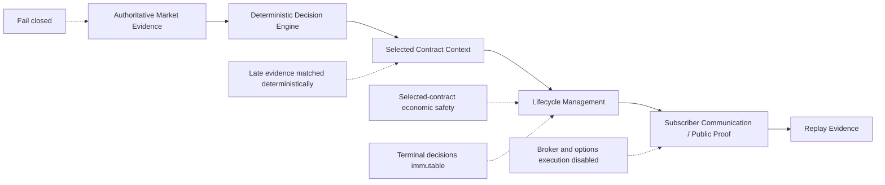

# Evidence-First Architecture

ASUMASNAM XSP separates evidence, deterministic authority, selected-contract truth, communication, and execution. The public architecture describes boundaries and invariants; private strategy predicates, thresholds, schemas, and orchestration remain private.

## Primary Flow

## Authoritative Market Evidence

Production market authority is AMEX:SPY using confirmed five-minute bars. Source and timeframe are part of the evidence contract. BATS is not current production authority, and non-authoritative evidence cannot silently substitute for the approved source.

Evidence that is missing, stale, malformed, mismatched, contradictory, or from an unapproved source fails closed.

## Deterministic Decision Authority

Validated evidence enters a deterministic decision engine. Code owns qualification, lifecycle progression, invalidation, safety gates, and whether an output may be surfaced.

AI-assisted perception or engineering may contribute supporting context, but model output is non-authoritative. It cannot create eligibility, override a deterministic block, or grant execution authority.

## Selected Contract Context

After a setup qualifies, the system persists the exact selected XSP contract and the authoritative contract price at alert. Public proof and post-alert measurement remain attached to that selected contract rather than using a hypothetical entry.

Contract-selection rules, selector thresholds, strike logic, provider mechanics, and instrument-matching internals are intentionally excluded.

## Asynchronous Evidence Composition

Market evidence and selected-contract economics can arrive at different times. Late-arriving evidence is deterministically matched to the decision it belongs to; it is not silently discarded or combined with an unrelated state.

The matching mechanism, identities, timing windows, queues, and persistence layout are private implementation details.

## Lifecycle Management

The public lifecycle is WAIT, ENTRY, CONTRACT, PROTECT, TAKE PROFIT, INVALIDATED, and RESET.

Selected-contract economics act as an independent safety check. Optimistic market-state language cannot override clearly contradictory contract economics. Once a decision is terminal, delayed evidence cannot resurrect it.

## Communication and Public Proof

Telegram communicates the meaningful subscriber lifecycle without exposing every internal evaluation. Automatic X opening proof is production-proven. The repaired terminal route is deployed but awaits natural production acceptance.

Public proof reports selected-contract behavior from the authoritative alert basis. It does not represent subscriber execution or realized P/L.

## Replay Evidence

Backend v1.4 support preserves replay-capable OHLCV bar evidence with source and timestamp identity. Live validity and replay capability are separate determinations. A session is replay-ready only after completeness and readiness checks pass.

Replay rendering is a planned consumer of this evidence archive; no production replay-video renderer is currently claimed.

## Authority Map

| Layer | Public responsibility | Authority |
| --- | --- | --- |
| Market evidence | Provide approved confirmed-bar observations | Authoritative only after deterministic validation |
| Decision engine | Qualify, invalidate, and progress lifecycle | Deterministic authority |
| Selected contract | Preserve the exact contract and alert basis | Deterministic persisted context |
| Economic safety | Challenge lifecycle optimism with contract truth | Independent deterministic safety authority |
| AI assistance | Observe, compare, summarize, or support engineering | Non-authoritative |
| Operator | Decide whether to trade | Sole trading authority |
| Broker/options execution | Not part of the current product | Disabled |
