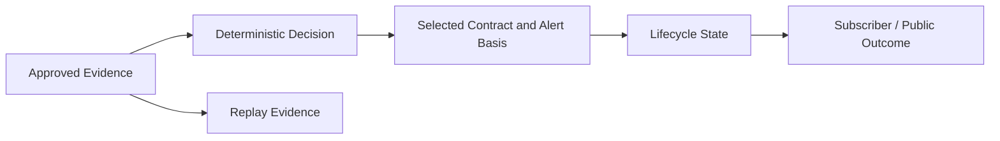

# Evidence and Auditability

ASUMASNAM XSP is designed so public and operator-facing decisions can be explained from approved evidence without exposing private strategy implementation.

## Auditable Decision Path

The audit story records the evidence authority, decision outcome, selected-contract context, lifecycle status, and communication result. Private field layouts, identifiers, schemas, and storage design are not part of the public contract.

## Evidence Authority

AMEX:SPY confirmed five-minute bars are the current production market authority. Source and timeframe validation are explicit and fail closed. Evidence that cannot establish the approved authority is not silently promoted.

## Selected-Contract Measurement

The exact selected XSP contract and its contract price at alert are preserved with the decision. Post-alert public measurement follows that same contract.

This supports truthful descriptions of contract behavior without claiming subscriber execution, realized P/L, or account performance.

## Asynchronous Composition

Market evidence and contract economics may arrive at different times. Late evidence is matched deterministically to the decision it belongs to. Missing or mismatched composition fails closed, and terminal lifecycle states remain immutable.

## Replay Readiness

Backend v1.4 support preserves replay-capable OHLCV bar evidence. Live validity and replay capability are distinct. A complete session must pass readiness checks before it is labeled replay-ready; partial, mixed, duplicate, or insufficient evidence remains non-ready.

## Communication Observability

Telegram and X are communication surfaces, not decision or execution authorities. The system distinguishes whether a lifecycle message or public-proof artifact was eligible, withheld, or awaiting acceptance without publishing private routing details.

Automatic X opening proof is production-proven. The repaired terminal route is deployed and awaiting natural production acceptance.

## Public Exclusions

The public audit story omits internal reason codes, transition identities, correlation keys, freshness windows, queue mechanics, database paths, complete schemas, private fixtures, and operational credentials.
