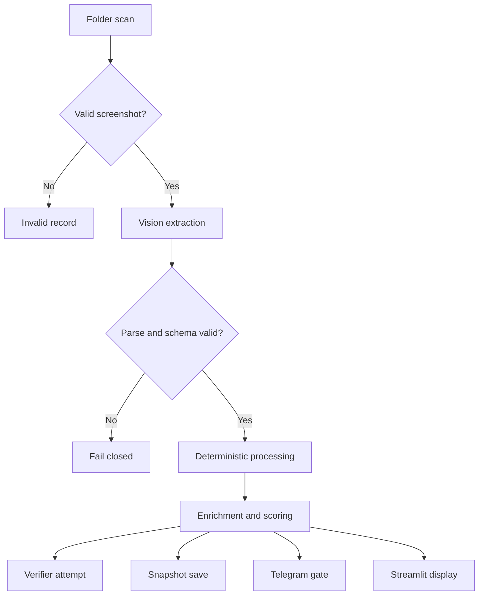

# Observability

The system is designed so operator facing outputs can be explained after the fact. The full local system uses snapshots, audit rows, issuance events, diagnostics, and review scripts/pages to make pipeline behavior visible without granting execution authority.

## Stage Level Tracking

The screenshot pipeline has distinct stages where success or failure can be identified:

Each stage has a different failure mode. Separating them helps distinguish input problems, provider problems, validation problems, deterministic suppression, and output surface behavior.

## Where Pipeline Failures Can Occur

Common failure points:

- no valid screenshot found
- unsupported filename or symbol
- OpenAI latency or API failure
- malformed model output
- JSON parse failure
- schema validation failure
- missing required market state fields
- contradictory or low quality continuation state
- snapshot persistence failure
- Telegram suppression, cooldown, or delivery failure
- read-only market data provider failure
- recommendation gate suppression or block

The intended behavior is to fail closed rather than fabricate confidence.

## Snapshot Persistence

Snapshots preserve market state and enrichment artifacts for review. The private system persists structure, setup clarity, confidence, and tradeability payloads as JSON fields, then deserializes them on read.

Snapshot based review allows post session analysis without re-running historical screenshots through vision extraction.

## Operator-Agent Audit Logging

The operator-agent audit path stores compact, safe metadata about each invocation. It is passive and does not alter agent behavior.

Representative persisted fields:

- trace ID
- timestamp
- request type
- status
- tool called flag
- tool name
- error code
- compact message
- tool result success flag

Raw tool results are not required for the public observability story and will not be exposed in this showcase repo.

## Recommendation Issuance Gate Logging

The recommendation issuance gate records whether a read-only recommendation artifact was issued, suppressed, or blocked. This supports session level review of duplicate suppression and state change behavior.

Tracked concepts:

- trade date
- session ID
- direction
- regime
- contract symbol
- recommendation identity
- prior recommendation context
- reason code
- issuance status

The gate decides surfacing only. It does not select contracts, execute orders, or reinterpret upstream deterministic eligibility.

## Outcome Tracking Distinction

Engine level outcome tracking exists in the private system for reviewing resolved signals and high confidence behavior.

Contract level outcome tracking for agent-called or operator agent surfaced recommendations is still in progress. This repository does not claim full performance attribution for contract level recommendations.
