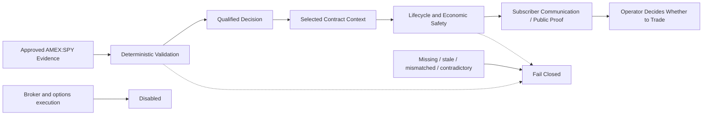

# Safety Model

Core principle: **AI can observe. Code must enforce. The operator decides.**

ASUMASNAM XSP is decision-support software. Broker execution and options execution are disabled.

## Safety Flow

## Authority Boundaries

- **Evidence validation** admits only the approved source and timeframe.
- **Deterministic decision logic** owns qualification, lifecycle progression, invalidation, and surfacing.
- **Selected-contract context** preserves the exact contract and alert basis.
- **Economic safety** independently checks whether contract behavior contradicts lifecycle optimism.
- **AI assistance** is non-authoritative and cannot bypass a deterministic gate.
- **Operator authority** owns the decision to trade.
- **Broker and options authority** is absent from the current product.

## Fail-Closed Posture

- Non-authoritative evidence cannot substitute for AMEX:SPY.
- Missing, stale, malformed, mismatched, contradictory, or incomplete evidence cannot silently escalate.
- Late-arriving evidence must match the decision it belongs to.
- Delayed evidence cannot resurrect a completed or invalidated decision.
- Replay evidence is not replay-ready until completeness and readiness checks pass.
- A communication failure cannot create execution authority.

## Public Safety Boundary

PROTECT and TAKE PROFIT are risk guidance, not order instructions or proof of subscriber action. Public proof describes selected-contract behavior from the authoritative alert basis; it does not report realized subscriber P/L.

Exact thresholds, confirmation predicates, freshness windows, correlation identities, private schemas, and selector logic are excluded from this repository.
