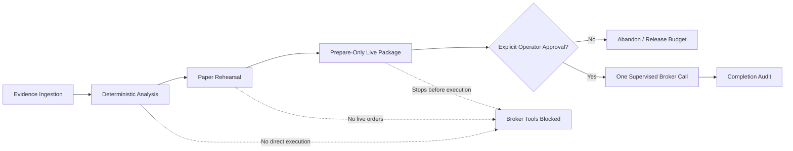

# Safety Model

Core principle: **AI can observe. Code must enforce. The operator decides.**

The system is designed around explicit authority layers. Each layer can add evidence, validation, posture, or audit context, but execution authority remains separated and gated.

## Authority Layers

* **Evidence ingestion**: receives and validates live market evidence.
* **Deterministic analysis**: classifies regime, setup quality, hold context, chop risk, and invalidation through code.
* **Paper rehearsal**: tests how a candidate would be packaged without live order authority.
* **Prepare-only live package**: assembles a supervised candidate while stopping before execution.
* **Explicit operator approval**: requires a human decision before any bounded live action could be considered.
* **One supervised broker call**: if separately enabled by official tools and policy gates, only one bounded broker action occurs after approval.
* **Completion audit**: records result, rejection, or abandoned state.

## Safety Boundaries

* No hidden autonomous execution loops.
* No LLM override of deterministic gates.
* No stale evidence escalation.
* No duplicate alert spam.
* No live options execution without separate official execution tooling and policy gates.
* Broker credentials and account identifiers are excluded from the public repo.

## Failure Posture

* Malformed evidence fails closed.
* Unsupported broker action fails closed.
* Missing policy fails closed.
* Ambiguous setup is suppressed.
* Cooldown and duplicate protection prevent repeated alerting.

## Public Artifact Rules

Public artifacts should show evidence flow, posture, suppression, rehearsal, and audit concepts without exposing execution-enabling material. Do not publish credentials, account identifiers, broker IDs, tokens, chat IDs, webhook secrets, raw MCP responses, private paths, raw screenshots, database files, or live order details.
